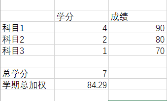
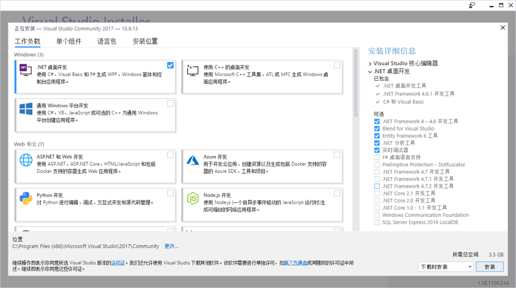

# 第一次作业
## 1.项目名称
### 学生学分绩点管理系统

## 2.功能
此项目为基于C#的学生学分绩点计算工具，实现了对学生学分绩点数据库的增、删、改、查询等基本操作。
## 3.安装流程
### 依赖项：
- 您的计算机必须运行Windows 10系统             
- 安装最新版本的Visual Studio 2017（安装地址：[Visual Studio](https://visualstudio.microsoft.com/zh-hans/downloads/)  ）      
- 安装.NET桌面开发

- 安装MySQL数据库（安装地址：[MySQL](https://dev.mysql.com/downloads/mysql/)）
## 4.项目测试与使用
### C#与数据库连接：通过ConfigurationManager.ConnectionString获取数据库的配置信息，进行数据库的连接
 ``` csharp
using System.Data; 
using System.Data.SqlClient; 
using System.Configuration;
 public static void SQLConn2()     
 
    {             
 
      String connStr = ConfigurationManager.ConnectionStrings["connStr"].ConnectionString; 
 
      SqlConnection conn = new SqlConnection(connStr);            
 
      Conn.Open();            
 
      SqlCommand cmd = new SqlCommand("select * from stocklog", Conn);         
 
     DataSet ds = new DataSet();          
 
      SqlDataAdapter da = new SqlDataAdapter(cmd);   
 
      da.Fill(ds);   
     }
 ```

## 5.项目作者
华中科技大学 电气与电子工程学院 何翊玮 学号：U201711814


