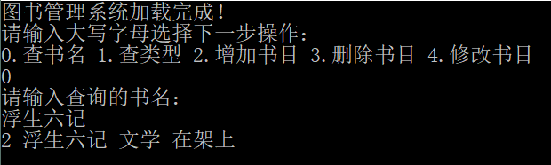
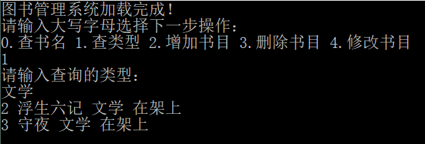
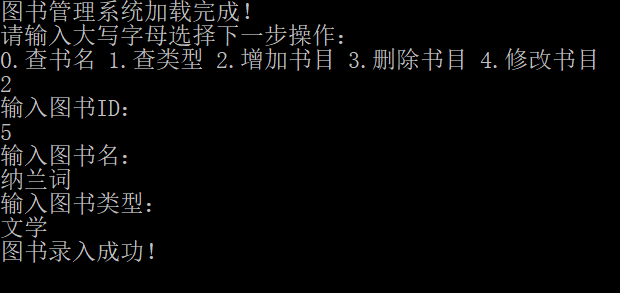
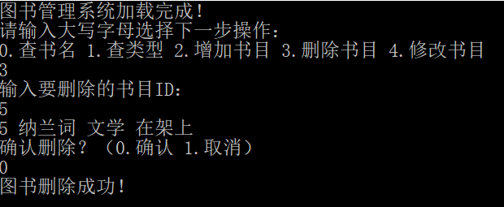
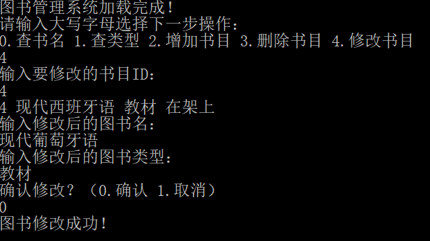

# 图书管理系统
作者  姚顺雨

---
### 1.系统简介
​        本图书管理系统可实现**对图书管理数据库的连接**，并可对存放图书信息的数据表进行操作，实现**图书查询**、**书目增删**、**书目信息修改**等功能。

### 2.运行环境

​        运行本系统需安装**Visual Studio**（2017版或更高版本），以及匹配的**.net桌面开发工具包**。

### 3.操作示例
##### 1、选择功能
​        根据提示，输入数字选择相应的功能。

##### 2、查询书目

​        包括根据书名查询书目和根据类型查询书目两种方式。

​        具体操作均为选择功能后，根据提示输入书名或类型，即可得到相关的全部书目信息。

##### 3、增添书目

​        可以向数据表中录入新的图书信息。

​        具体操作为，选择功能后，根据提示依次录入新书目的ID、书名、类型，即可完成新书目的录入。

##### 4、删除书目

​        可以将已存在的书目从数据表中移出。

​        具体操作为，选择功能后，输入需要删除的书目ID，此时书目相关信息将会显示在屏幕上，确认操作即可删除该书目，若取消操作则不会删除该书目。

##### 5、修改书目信息

​        可以修改已存在书目的书名、类型等信息。

​        具体操作为，选择功能后，输入需要修改的书目ID，此时书目相关信息将会显示在屏幕上；接下来依次录入修改后的书目的书名、类型，若确认修改则新的书目信息将覆盖原来的信息，若取消操作则原来的书目信息将得到保留。

